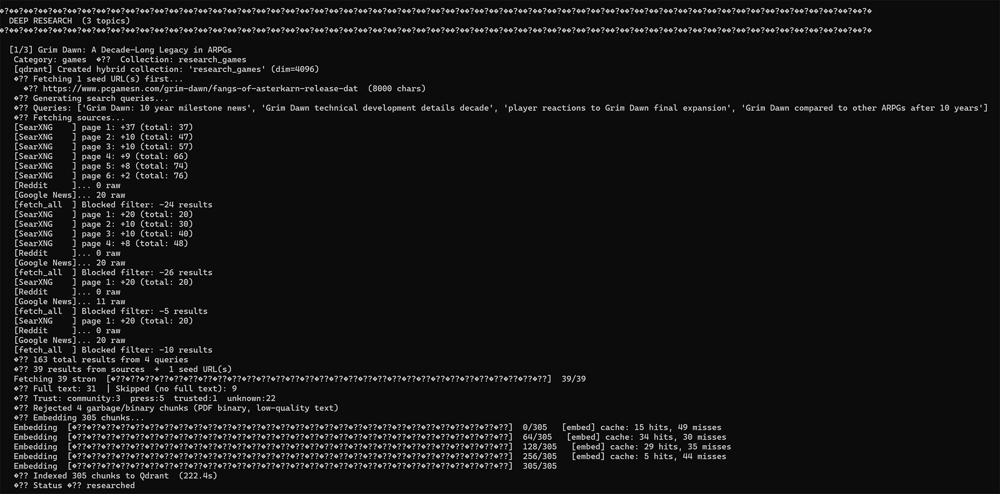
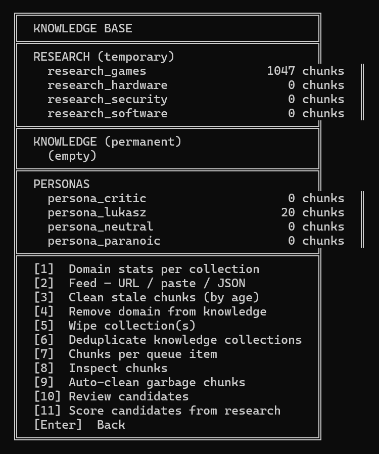

# NonSequitur — Autonomous Research & Publishing Platform

> *Non sequitur* — in logic, a conclusion that doesn't follow from its premises. In practice, a platform that doesn't follow the industry's obsession with scale, reach, and optimizing for what already ranks.
>
> *The stack exists to serve one purpose: give a single person the research capacity of a newsroom and the editorial independence of nobody's employee.*

Most AI writing tools make it faster to write about what everyone is already writing about. NonSequitur is built for the opposite: any topic, any angle, any voice — with honest analysis and no PR appeasement. The system runs on local hardware, no cloud APIs in the core pipeline, and publishes directly to CMS.

It searches the web, reads dozens of sources, extracts and curates factual knowledge into a permanent vector database, and writes in the author's voice — not by prompt injection, but by retrieving stored opinions, style, and curated facts from Qdrant at generation time. Every article is anchored to a human-written thesis the model cannot override. The pipeline runs unattended overnight. The editorial direction does not.

**Live output:** [lucasgraphic.com](https://lucasgraphic.com) — DATA / LAB / PORTFOLIO sections.

---

## What It Actually Does

The system is a fully autonomous content pipeline with a human in the editorial loop — not the production loop. Here is what happens without manual intervention:

1. **Discovers** candidate topics from SearXNG, Reddit, and Google News — filtered by domain trust tier, scored by relevance, deduplicated
2. **Researches** each topic: generates targeted search queries, fetches full-text content via Chromium crawler, chunks and embeds into Qdrant with hybrid dense+sparse vectors
3. **Extracts knowledge** using an LLM to distill key facts from research into a permanent, curated knowledge base — facts that persist across article cycles and improve future generation quality
4. **Picks a focus angle** — 20 LLM-generated thesis angles drawn from the top research chunks, human-selected before generation
5. **Generates** 800–1200 word articles with enforced thesis, persona voice injection, and neural reranking of research context
6. **Optionally rewrites** with Claude Sonnet for editorial polish

The result: one person running a content operation that would typically require a research team, with full editorial control and zero cloud dependency in the core pipeline.

---

## Architecture

```
Discovery ──► Research ──► Extract ──► Generate ──► Claude Rewrite ──► Payload CMS
   │              │            │           │               │
SearXNG        Qdrant       qwen3.6     Ollama         Anthropic API
Reddit         Crawl4AI     27b LLM     qwen3.6        (optional)
Google News    Trafilatura   fact        27b/122b
               Reranker      distill
```

### Pipeline Stages

**1. Discovery** — SearXNG meta-search, Reddit, Google News. Results filtered through `domain_config.py` (trusted/blocked domain registry with per-category tier weights), scored, deduplicated, and presented in an interactive terminal selector. Supports LLM-generated topic name suggestions and human-written focus angle before queuing.

**2. Deep Research** — generates 4–6 LLM search queries targeting the article's focus angle. Fetches full-text via Crawl4AI (Chromium), Playwright fallback, Trafilatura extraction layer. Text is chunked at section boundaries (markdown headings as hard splits), embedded with `qwen3-embedding:8b-q8_0` (4096 dims), and indexed into per-category Qdrant collections with hybrid dense+sparse (BM25/RRF) vectors. Blocked domains are filtered before fetch, not after.

**3. Knowledge Extraction** — after research, `qwen3.6:27b` reads each fetched URL and distills 3–6 factual paragraphs per source. Human reviews extracted facts (keep/delete/edit), approves, and they are embedded into a permanent `knowledge_{category}` collection. Research chunks are then wiped. Knowledge accumulates across article cycles — each new article benefits from everything curated before it.

**4. Focus Picker** — before generation, presents 20 LLM-derived thesis angles from the top research chunks. Human selects, edits, or writes their own. Night run uses the stored focus directly.

**5. Generate** — hybrid RAG retrieves from `research_{cat}`, `knowledge_{cat}`, and `persona_{name}` simultaneously. BAAI/bge-reranker-v2-m3 cross-encodes all candidates against the full query context and orders by direct relevance — not vector similarity. Top 20 chunks enter `_build_prompt()`. Prompt separates persona voice, research facts, and thesis direction into distinct semantic blocks. The model cannot override the focus angle or invent facts not present in context.

**6. Claude Rewrite** *(optional)* — Anthropic Claude Sonnet for editorial polish. Factual content and sourced claims are never altered.

**7. Payload CMS Import** *(in development)* — direct API push to PayloadCMS.

---

## Stack

| Component | Technology | Host |
|-----------|-----------|------|
| LLM Generate | Ollama + qwen3.6:27b / qwen3.5:122b | Windows, RTX 5090 |
| LLM Embed | Ollama + qwen3-embedding:8b-q8_0 | Ubuntu, GTX 1080 |
| LLM Score / Focus | Ollama + qwen3.5:4b | Ubuntu, GTX 1080 |
| Vector DB | Qdrant | Ubuntu |
| Neural Reranker | BAAI/bge-reranker-v2-m3 (FastAPI) | Ubuntu, GTX 1080 |
| Web Search | SearXNG (self-hosted) | Ubuntu |
| Web Crawler | Crawl4AI (FastAPI + Chromium) | Ubuntu |
| Fallback Fetch | Playwright service | Ubuntu |
| Cache | Valkey (Redis-compatible) | Ubuntu |
| CMS | PayloadCMS 3.x + MongoDB | Ubuntu |
| Frontend | Next.js 15 + Tailwind CSS v4 | Ubuntu (PM2/nginx) |

### Model Tiers

| Key | Model | Parameters | Use |
|-----|-------|-----------|-----|
| DEV | qwen2.5:7b | 7B | Fast iteration, testing |
| NORMAL | qwen3.6:27b | 27B | Daily production |
| NORMAL2 | qwen3.5:35b-a3b | 35B MoE | Evaluation variant |
| MAX | qwen3.5:122b | 122B | Maximum quality, CPU offload |
| Embed | qwen3-embedding:8b-q8_0 | 8B | 4096-dim dense vectors |
| Score | qwen3.5:4b | 4B | Knowledge scoring, Focus Picker |

All qwen3.5/qwen3.6 models require `/api/chat` with `think: false`. `num_predict=2500` prevents infinite generation loops inherent to the architecture.

---

## Why The Knowledge Base Changes Everything

Most RAG pipelines throw away research after each article. NonSequitur accumulates it.

After researching a topic, `qwen3.6:27b` reads every fetched source and distills the factual content into 3–6 dense paragraphs per URL. A human reviews each extraction — keeping what is accurate and useful, deleting what is not — and approves them into a permanent `knowledge_{category}` collection. The raw research chunks are then wiped.

The result: each new article about a topic the system has covered before starts with curated, high-quality context already in Qdrant. The model does not re-derive what Phoenix Corp is or when Unreal Engine 6 was announced — it already knows, and that knowledge came from human-reviewed sources, not a language model's training data.

Over time, `knowledge_games`, `knowledge_hardware`, and `knowledge_evergreen` become a dense, accurate, noise-free reference base. The gap between a first article on a topic and a tenth article on that topic grows wider with each cycle.

### Knowledge Architecture

```
Research chunks (temporary)
  └── qwen3.6:27b extraction
        └── Human review (keep / delete / edit)
              └── knowledge_{category}  ←  permanent, per topic_slug
              └── knowledge_evergreen   ←  permanent, cross-category

knowledge_{category}
  ├── topic_slug: "replaced"            ← game-specific facts
  ├── topic_slug: "unreal-engine-6"     ← engine-specific facts
  └── topic_slug: "doom-the-dark-ages"  ← etc.

knowledge_evergreen
  ├── category: "games"                 ← genre/industry context
  ├── category: "hardware"              ← GPU architecture, benchmarks
  └── category: "ai-data"              ← AI/ML concepts
```

### Extract Flow

```
research_games (525 chunks, 31 URLs)
  │
  ├── [auto-clean]  garbage removed (~150 chunks)
  │
  ├── [extract]  qwen3.6:27b reads each URL
  │     ├── URL 1: analogstickgaming.com  → 4 facts extracted
  │     ├── URL 2: thegamer.com           → 5 facts extracted
  │     ├── URL 3: quora.com              → NONE (no relevant facts)
  │     └── ...
  │
  ├── [human review]  keep / delete / edit per fact
  │
  ├── [deduplicate]  cross-URL duplicate removal
  │
  └── knowledge_games: 6 clean chunks  ←  permanent
      research_games: wiped
```

Knowledge chunks carry `source: "extracted"`, `trust_score: 0.85`, and are weighted above generic research context in retrieval. The extraction pipeline supports resume — if interrupted, it skips URLs already processed in the current session.

---

## Neural Reranker

After hybrid RAG retrieval, all candidate chunks pass through **BAAI/bge-reranker-v2-m3** — a cross-encoder model that scores each chunk against the full query context, not just vector similarity.

The reranker runs as a dedicated FastAPI service on Ubuntu/GTX 1080. It receives up to 35 raw candidates and returns a precision-ordered list. Only the top 20 enter `_build_prompt()`.

Embedding similarity is a blunt instrument. A chunk about "game engine performance" scores highly for almost any gaming query. The reranker demotes generic context and promotes chunks with direct factual relevance to the specific article angle. The result is a tighter research block — which directly improves output specificity.

---

## Vector Database

Qdrant stores all research, knowledge, and persona context as 4096-dimensional vectors across per-category collections — the full output of `qwen3-embedding:8b-q8_0`, not a compressed approximation.

**Collections:**

```
research_{category}     ← per-item research, temporary (~50–300 chunks)
knowledge_{category}    ← curated extracted facts, permanent, human-reviewed
knowledge_evergreen     ← cross-category permanent context
persona_{name}          ← author voice, opinions, and style chunks
```

**Retrieval per generation:**

```
generate(category=games, slug=replaced)
  → research_games        (hybrid, top_k=20, filter: item_id)
  → knowledge_games       (hybrid, top_k=7,  filter: topic_slug=replaced)
  → knowledge_evergreen   (hybrid, top_k=5,  filter: category=games)
  → persona_lukasz        (dense,  top_k=20)
  → reranker              (cross-encode all → top 20)
  → _build_prompt()
```

Hybrid retrieval fuses dense semantic vectors with sparse BM25 keyword vectors via RRF (Reciprocal Rank Fusion). Per-payload filters on `topic_slug`, `category`, and `evergreen` flags apply at query time. HNSW indexing maintains sub-10ms query times regardless of collection size.

---

## Prompt Architecture

`_build_prompt()` in `pipeline/generate_run.py` separates context into distinct semantic blocks:

```
=== YOUR PERSONA ===       ← worldview, editorial stance, tone (HOW to write)
=== AUTHOR VOICE ===       ← RAG chunks from persona_{name}
=== RESEARCH FACTS ===     ← RAG chunks from research + knowledge collections
=== ARTICLE DIRECTION ===  ← mandatory focus angle (WHAT to argue)
```

**Hard constraints enforced in prompt:**
- Never invent benchmark numbers, version strings, or release dates not present in context
- Focus angle is mandatory — the model cannot substitute or dilute it
- No generic CTAs, no PR framing, no hedging language
- H2 headers with specific section angles, not topic labels
- No repetition between sections

`_build_prompt()` is critical infrastructure. Every change affects all output quality.

---

## Domain Trust System

`data/domains_trusted.json` — per-category trust tiers (`trusted`, `press`, `community`) with retrieval boost multipliers (0.55–0.95). 195 domains across 9 categories. Tier determines RAG score weighting and reranker priority.

`data/domains_blocked.json` — master blocked list: domains, URL patterns, and title patterns. Applied at three levels: SearXNG result filter, fetch-time skip, and auto-clean during knowledge review. Adding a domain to the blocked list propagates everywhere immediately.

Both files are the single source of truth. No domains are hardcoded in application code.

---

## Content Quality

**Auto-clean** runs before any knowledge review and removes:
- GDPR/TCF consent walls and cookie tables
- Newsletter signup fragments and affiliate copy
- Discourse forum metadata and Reddit comment noise
- Author biography boilerplate
- Site navigation dumps and related-article lists
- JavaScript fragments and structured data leaks
- Wikipedia infobox tables and metadata headers
- Sponsored content markers
- Steam store pages and shopping pages

**Chunk quality:**
- Section-aware chunking — markdown headings act as hard boundaries, overlap never bleeds across sections
- Minimum chunk size enforced (80 chars)
- Language detection — non-English pages rejected before embedding
- Duplicate detection across knowledge collections

---

## What Works

- [x] Full Discovery → Research → Extract → Generate pipeline
- [x] Hybrid RAG: dense + sparse vectors (BM25/RRF fusion)
- [x] BAAI/bge-reranker-v2-m3 neural reranking
- [x] Permanent knowledge base with LLM extraction + human review
- [x] Knowledge retrieval by `topic_slug` and `category` at generation time
- [x] Persona injection via RAG (separate from research context)
- [x] Focus angle enforcement — model cannot override
- [x] Blocked domain filter at fetch time, discovery time, and auto-clean
- [x] Single-source domain config (trusted + blocked JSON files)
- [x] Section-aware chunking with heading boundary detection
- [x] Live slug autocomplete in queue
- [x] Claude Sonnet rewrite stage (optional)
- [x] Focus Picker — 20 LLM angles, human selects before generation
- [x] Auto-garbage detection before knowledge review

## In Development

- [ ] Payload CMS import
- [ ] Night run — batch pipeline with morning digest
- [ ] Personas — neutral / critic / paranoic style variants
- [ ] `_finalize_item()` — unified discovery flow
- [ ] SearXNG engine tuning — deeper pagination, more sources
- [ ] Uber Research — iterative research with coverage scoring

---

## Performance

| Metric | Value |
|--------|-------|
| Research time (40 URLs) | ~5–6 min |
| Generate time (27b) | ~75–90s |
| Extract time per URL | ~15–25s |
| Article body | ~6000–9000 chars |
| RAG pool before reranking | 35 chunks |
| RAG top_k after reranking | 20 chunks |
| Embedding dimensions | 4096 |
| Valkey cache hit rate | ~30–50% on re-runs |

---

## Editorial Mission

NonSequitur covers topics the mainstream gaming and tech press ignores, undercovers, or sanitizes — contrarian angles, honest criticism, analysis without PR appeasement. Quality is measured by argument depth and coverage utility, not trending score or press ratio.

The platform writes what IGN, PC Gamer, and VentureBeat won't — because they optimise for a different audience, different advertisers, and different incentives. Every article is anchored to a thesis the author chose and the model cannot override. The pipeline automates the labour. The editorial direction remains human.

---
## Screenshots
 
### Main Menu

 
### Discovery

 
### Queue

 
### Research

 
### Knowledge Base

 
### Extract — LLM Fact Review

 
### Focus Picker

 
### Generate

 
---

## Author

**Łukasz Grochal** — photographer, web developer, AI art creator.
[lucasgraphic.com](https://lucasgraphic.com) · Norway

---

*Built entirely on self-hosted infrastructure. No cloud LLMs in the core pipeline. No subscriptions. No data leaving the local network except for the optional Claude rewrite stage.*
