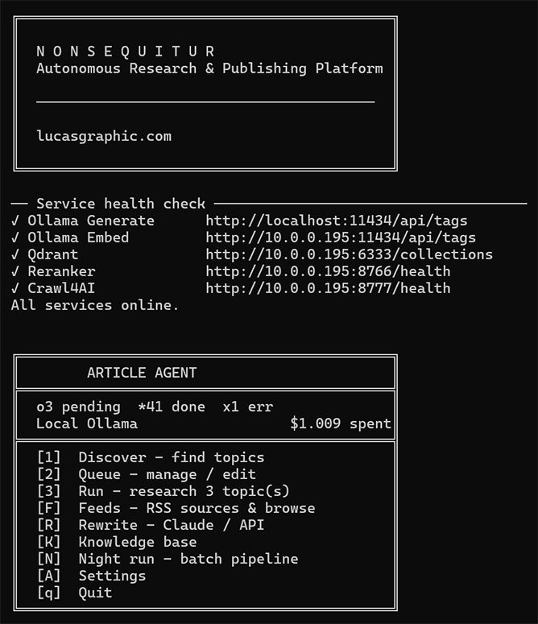
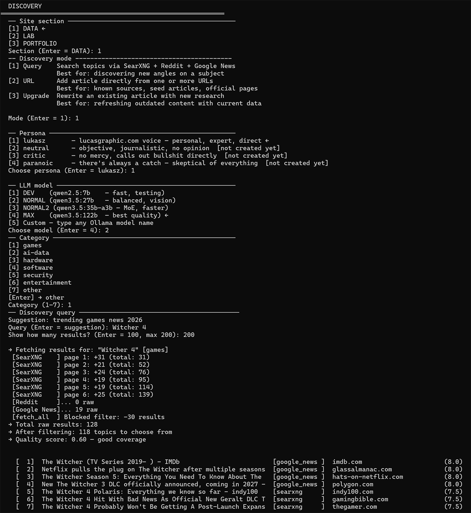
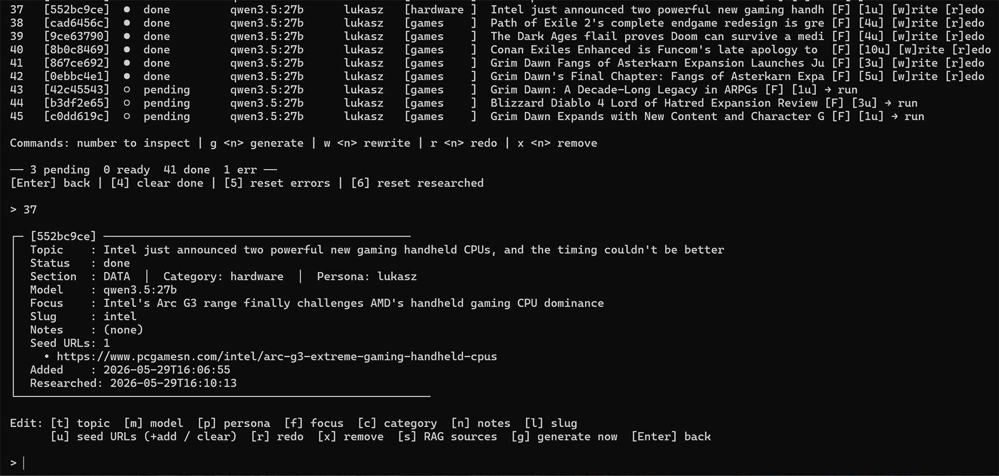

# NonSequitur — Autonomous Research & Publishing Platform

> *Non sequitur* — in logic, a conclusion that doesn't follow from its premises. In practice, a platform that doesn't follow the industry's obsession with scale, reach, and optimizing for what already ranks.
>
> *The stack exists to serve one purpose: give a single person the research capacity of a newsroom and the editorial independence of nobody's employee.*

Most AI writing tools make it faster to write about what everyone is already writing about. NonSequitur is built for editorial control: any topic, any angle, any voice — with honest analysis and no PR appeasement. Generated entirely on local hardware, published directly to CMS, with no cloud APIs in the core pipeline.

It searches the web, reads dozens of sources, and writes in the author's voice — not by prompt injection, but by retrieving stored opinions and style from a vector database at generation time. Every article is anchored to a human-written thesis the model cannot override. The pipeline runs unattended. The editorial direction does not.

Under the hood: qwen3-embedding at 4096 dimensions, hybrid dense+sparse retrieval with BM25/RRF fusion, BAAI neural reranking, models up to 122B parameters, a self-hosted meta-search engine, Chromium-based full-text crawler, and a Qdrant vector database — all on local hardware, no subscriptions, no external APIs.

Live output: **[lucasgraphic.com](https://lucasgraphic.com)** — DATA / LAB / PORTFOLIO sections.

---

## Architecture

```
Discovery ──► Research ──► Generate ──► Claude Rewrite ──► Payload CMS
   │              │             │              │
SearXNG        Qdrant        Ollama        Anthropic API
Reddit         Crawl4AI      qwen3.5       (optional)
Google News    Trafilatura   27b/122b
HuggingFace    Reranker
```

**→ [Full pipeline walkthrough with ASCII diagrams](docs/ARCHITECTURE.md)**

### Pipeline stages

**1. Discovery** — finds candidate topics via SearXNG (self-hosted meta-search), Reddit, Google News, and HuggingFace. Results are filtered through `domain_config.py` (trusted/blocked domain registry), scored by source quality and keyword relevance, and presented in an interactive terminal selector with per-result domain visibility.

**2. Deep Research** — for each queued topic, generates 4–6 LLM search queries targeting the article's focus angle, fetches full-text content via Crawl4AI (Chromium-based) with Playwright fallback, chunks text at 800 chars with 100-char overlap, embeds with `qwen3-embedding:8b-q8_0` (dim=4096), and indexes into per-category Qdrant collections using hybrid dense+sparse (BM25/RRF) vectors.

**3. Generate** — retrieves top-35 chunks via hybrid RAG with per-trust-tier score thresholds, reranks with BAAI/bge-reranker-v2-m3, builds a structured prompt with persona context and research facts in separate blocks, and generates 1500–2200 word articles with mandatory focus angle enforcement.

**4. Claude Rewrite** *(optional)* — sends the draft to Anthropic Claude Sonnet for editorial polish while preserving factual content from the research context.

**5. Payload CMS import** *(in development)* — pushes finished articles directly to PayloadCMS via API.

---

## Stack

| Component | Technology | Host |
|-----------|-----------|------|
| LLM Generate | Ollama + qwen3.5:27b / 122b | Windows, RTX 5090 |
| LLM Embed | Ollama + qwen3-embedding:8b-q8_0 | Ubuntu, GTX 1080 |
| LLM Score | Ollama + qwen3.5:4b | Ubuntu |
| Vector DB | Qdrant | Ubuntu |
| Reranker | BAAI/bge-reranker-v2-m3 (FastAPI) | Ubuntu |
| Web Search | SearXNG (self-hosted) | Ubuntu |
| Web Crawler | Crawl4AI (FastAPI + Chromium) | Ubuntu |
| Fallback Fetch | Playwright service | Ubuntu |
| Cache | Valkey (Redis-compatible) | Ubuntu |
| CMS | PayloadCMS 3.x + MongoDB | Ubuntu |
| Frontend | Next.js 15 + Tailwind CSS v4 | Ubuntu (PM2/nginx) |

### Model tiers

| Key | Model | Use case |
|-----|-------|----------|
| DEV | qwen2.5:7b | Fast iteration, testing |
| NORMAL | qwen3.5:27b | Daily production |
| NORMAL2 | qwen3.5:35b-a3b | MoE variant, evaluation |
| MAX | qwen3.5:122b | Maximum quality |
| Embed | qwen3-embedding:8b-q8_0 | 4096-dim dense vectors |
| Score | qwen3.5:4b | Knowledge candidate scoring |

All qwen3.5 models use `/api/chat` with `think: false` — never `/api/generate`.

---

## Knowledge Base

```
knowledge_{category}              ← permanent, curated evergreen content
knowledge_{category}_candidates   ← 7-day window, pending human review
research_{category}               ← per-item research, lives until item removed from queue
persona_{name}                    ← author voice chunks for RAG persona injection
```

Categories: `games`, `ai-data`, `hardware`, `software`, `security`, `entertainment`, `photography`, `drone`, `3d`, `ai`, `other`.

Retrieval uses hybrid search (dense + sparse BM25/RRF), per-trust-tier minimum score thresholds (`press/trusted: 0.001`, `community: 0.010`, `unknown: 0.020`), and BAAI reranker for final top-35 selection.

---

## Content Filter

`pipeline/content_filter.py` — unified garbage detection, single source of truth for both indexing and RAG retrieval:

- PDF binary and non-printable content
- JavaScript / JSON-LD fragments
- Affiliate and coupon copy
- Author biography boilerplate
- SaaS marketing CTA patterns (`request a demo`, `book a free call`, etc.)
- Facebook/Instagram navigation leaks
- Cookie consent fragments
- Forum noise and reply metadata
- Off-topic geography/history content
- Benchmark boilerplate

`data/domains_blocked.json` — master blocked domain list (social media, video platforms, key shops, forums, dictionaries, price aggregators). Applied at fetch time in `discovery/sources.py:fetch_all()` and at discovery filter time in `discovery/filter.py:filter_and_rank()`.

`data/domains_trusted.json` — per-category trust tiers (`trusted`, `press`, `community`) with retrieval boost multipliers (0.55–0.95).

---

## Prompt Architecture

`pipeline/generate_run.py:_build_prompt()` separates context into distinct blocks:

```
=== YOUR PERSONA ===          ← voice, tone, worldview (HOW to write)
=== AUTHOR VOICE ===          ← RAG chunks from persona_{name} collection
=== RESEARCH FACTS ===        ← RAG chunks from research_{category} collection
=== ARTICLE DIRECTION ===     ← mandatory focus angle (WHAT to argue)
```

Hard rules enforced in prompt:
- Never invent benchmark scores or version numbers not present in research context
- No HTML comments or annotations
- No generic CTAs
- Focus angle is mandatory — model cannot substitute its own angle
- H2 headers every 2–3 paragraphs with specific section angles

---

## Discovery UI

Interactive terminal selector with:
- Per-result domain display for source evaluation
- Live char-by-char slug autocomplete via `msvcrt` (Windows) / `termios` (Linux)
- `data/slugs.json` — local slug registry auto-populated on generate
- 10 LLM-generated topic name suggestions per article
- Clean FOCUS input — editorial thesis is always human-written, never LLM-suggested
- Merge/separate decision before topic naming for multi-URL imports

---
## Screenshots




## What Works

- [x] Full Discovery → Research → Generate pipeline
- [x] Hybrid RAG with dense + sparse vectors
- [x] Per-category Qdrant collections
- [x] BAAI/bge-reranker-v2-m3 reranking
- [x] Persona injection via RAG (separate from research context)
- [x] Focus angle enforcement in prompt
- [x] Unified content filter (`content_filter.py`)
- [x] Blocked domain filter at fetch time
- [x] Per-trust-tier RAG score thresholds
- [x] Live slug autocomplete
- [x] Claude Sonnet rewrite stage
- [x] Qdrant cleanup on queue item removal and reset
- [x] 10-topic LLM suggestion picker in discovery

## In Development

- [ ] Payload CMS import (dev environment first)
- [ ] Night run — batch pipeline with morning digest
- [ ] Per-category knowledge base population
- [ ] `_finalize_item()` — unified URL/query/upgrade flow
- [ ] SearXNG engine tuning (paging support)
- [ ] Uber Research mode — iterative research with coverage scoring
- [ ] Personas: neutral / critic / paranoic

---

## Editorial Mission

NonSequitur is built to cover topics the mainstream gaming and tech press ignores, undercovers, or sanitizes — contrarian angles, honest criticism, analysis without PR appeasement. Quality is measured by argument depth and coverage utility, not trending score or press ratio. The platform is designed to write what IGN, PC Gamer, and VentureBeat won't, because they are optimizing for a different audience.

---

## Author

**Łukasz Grochal** — photographer, web developer, AI art creator.  
[lucasgraphic.com](https://lucasgraphic.com) · Norway

---

*Built entirely on self-hosted infrastructure. No cloud LLMs in the core pipeline. No subscriptions. No data leaving the local network except for optional Claude rewrite.*
