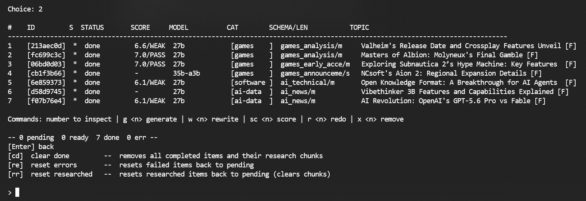
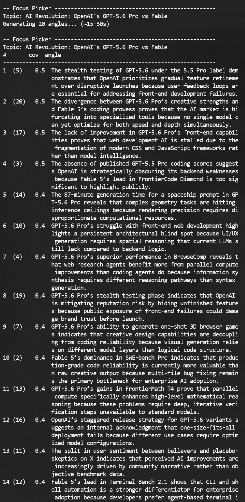
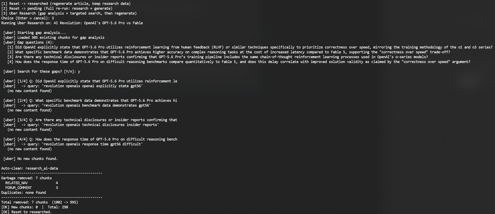
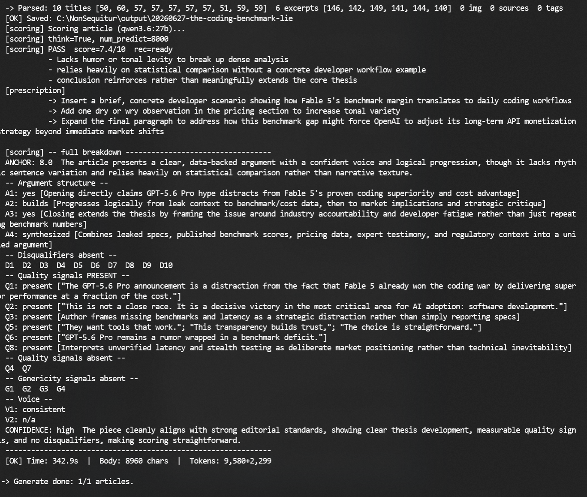

# NonSequitur

> *The LLM writes. You argue.*

Most AI writing tools give you a generic article. NonSequitur gives you a researched argument — in your voice, on topics the mainstream press ignores.

You pick the thesis. The pipeline does the rest.

**Live output:** [lucasgraphic.com](https://lucasgraphic.com)

---

## Why not just use ChatGPT?

You probably already tried. Here is what you ran into:

**It sounds like ChatGPT.** Every output has the same hedged, balanced, inoffensive tone. "On one hand... on the other hand..." It has no opinion because it was trained to have no opinion. You can prompt it to be more direct, but the underlying voice never changes.

**It hallucinates sources.** Ask it to cite something and it invents plausible-sounding URLs. The article reads well. The research does not exist.

**It has no memory.** Start a new session and it knows nothing about your previous work, your knowledge base, your voice, or the sources you already crawled. Every run starts from zero.

**It drifts off-topic.** Give it a specific thesis and it will summarize the topic instead. The argument you wanted becomes a balanced overview nobody asked for.

**It writes about what everyone else is writing about.** ChatGPT's training data is mainstream. Its topic suggestions are mainstream. Its angles are mainstream. If you want to cover what IGN and TechCrunch already covered, it works fine.

NonSequitur is built to solve all of these — specifically, not generally.

---

## The problem with AI writing

ChatGPT writes in ChatGPT's voice. It hallucinates sources. It has no memory between sessions. It produces the same balanced, hedged, inoffensive take every time.

NonSequitur is built around the opposite assumptions:

- Every article starts with a **mandatory thesis** you chose — the model cannot override it
- Research is real: web crawling, full-text indexing, neural reranking — no hallucinated citations
- Your voice is injected via RAG from a personal persona collection you built yourself
- A scoring system tells you *why* an article is weak and *what specifically* to fix

---

## What it looks like

| | |
|---|---|
|  |  |
| Queue — score and verdict per article | Focus picker — 20 angles ranked by research coverage |
|  |  |
| Uber Research — fills gaps before generation | Scoring — 8-phase breakdown with fix prescription |

→ [All screenshots](docs/screenshots/)

---

## How it works

```
You choose a topic
        │
        ▼
Discovery — SearXNG + Reddit + Google News
        │
        ▼
Research — crawl sources, chunk, embed, index into Qdrant
        │
   Suitability gate — thin research? Uber Research fills the gaps
        │
        ▼
You pick the thesis angle (20 options ranked by research coverage)
        │
        ▼
Generate — your persona injected via RAG, thesis enforced
        │
        ▼
Score — 8-phase audit: argument structure, voice, quality signals
        │
        ▼
article.md  +  optional Polish/Norwegian translation via Bielik
```

Runs overnight without supervision. You review in the morning.

---

## What makes it different

**Thesis enforcement.** You select a focus angle before generation. The model builds the article around that argument — it cannot drift into a generic overview.

**Your voice, not ChatGPT's.** A persona collection in Qdrant holds rhetorical chunks extracted from your own writing across 7 dimensions (argument, critique, skepticism, reference, appreciation, humor, personal). Retrieved at generation time based on the article's focus.

**Real research.** SearXNG meta-search, full-text Chromium crawling, BM25 pre-ranking, BAAI neural reranking. Sources cited in output are sources that were actually read.

**Honest scoring.** The scoring pass runs a separate LLM call with `think=True` and audits 10 disqualifiers, 8 quality signals, 4 genericity signals, and argument structure A1–A4. It tells you the specific sentence that failed and what to rewrite.

**Permanent knowledge base.** Research chunks persist across sessions. The system builds domain knowledge over time — not a blank slate every run.

---

## Stack

Fully self-hosted. No cloud APIs in the core pipeline.

| Role | Technology | Hardware |
|------|-----------|----------|
| Generate | Ollama + qwen3.6:27b / qwen3.5:122b | Windows, RTX 5090 |
| Score | Ollama + qwen3.6:27b (think=True) | Windows, RTX 5090 |
| Translate | Bielik 11B v2.2 Q8\_0 | Windows, RTX 5090 |
| Embed | qwen3-embedding:8b (4096-dim) | Ubuntu, GTX 1080 |
| Rerank | BAAI/bge-reranker-v2-m3 | Ubuntu, GTX 1080 |
| Vector DB | Qdrant | Ubuntu |
| Search | SearXNG (self-hosted) | Ubuntu |
| Crawler | Crawl4AI + Chromium | Ubuntu |

Minimum: one GPU with 24GB+ VRAM for 27b models. Ubuntu server for always-on services.

---

## Requirements

**Machine 1 — Windows:**
- NVIDIA GPU 24GB+ VRAM
- Ollama: `qwen3.6:27b`, `qwen3.5:35b-a3b`, `qwen2.5:7b`, `SpeakLeash/bielik-11b-v2.2-instruct:Q8_0`
- Python 3.11+

**Machine 2 — Ubuntu:**
- Any NVIDIA GPU (GTX 1080 8GB is sufficient)
- Qdrant, SearXNG, Crawl4AI, Valkey, BAAI reranker

---

## Quick Start

```bash
git clone https://github.com/LucasGraphic/nonsequitur
cd nonsequitur
pip install -r requirements.txt
cp .env.example .env
# set Machine 2 IP addresses in .env
python nonsequitur.py
```

→ [docs/setup.md](docs/setup.md) — full installation guide
→ [docs/persona-system.md](docs/persona-system.md) — building your voice
→ [docs/rag-architecture.md](docs/rag-architecture.md) — retrieval and reranking
→ [docs/schemas.md](docs/schemas.md) — 12 article schemas

---

## What Works

- [x] Full Discovery → Research → Generate → Score pipeline
- [x] Suitability gate — rejects topics with insufficient research before generation
- [x] Uber Research — gap analysis + targeted search for thin topics
- [x] Hybrid RAG: dense + sparse vectors (BM25/RRF fusion)
- [x] BAAI/bge-reranker-v2-m3 neural reranking
- [x] Permanent knowledge base with LLM extraction + human review
- [x] Persona injection via RAG (trigger-vector ranked, threshold filtered)
- [x] Persona Builder — AI-assisted chunk creation (Paste and Converse modes)
- [x] Dynamic persona list from Qdrant — add new personas without config changes
- [x] Focus angle enforcement — model cannot override
- [x] Schema Suggester — BM25 + LLM selects from 12 article schemas
- [x] Focus Picker — 20 LLM angles sorted by BM25 research coverage, `[r]` reroll for fresh angles
- [x] Focus Validator — BM25 + LLM check before generation
- [x] Scoring Pass — 8-phase quality scoring with prescription (EXCELLENT/STRONG/PASS/WEAK/FAIL)
- [x] Generation history — score/schema/length tracked per article, viewable in queue
- [x] Translation — on-demand Polish/Norwegian via Bielik 11B, saved alongside source article
- [x] Night run — autonomous batch pipeline
- [x] Clip — paste URL directly into research queue

## In Development

- [ ] Morning digest — score summary after night run
- [ ] Multi-article synthesis

---

## Performance

| Metric | Value |
|--------|-------|
| Research (~40 URLs) | 5–6 min |
| Generation (27b) | 150–220s |
| Article body | 6000–12000 chars |
| RAG chunks (after rerank) | ~28 |
| Embedding dimensions | 4096 |

---

## Editorial Mission

NonSequitur covers topics the mainstream gaming and tech press ignores, undercovers, or sanitizes. Quality is measured by argument depth and honest coverage — not trending score or press ratio.

Every article is anchored to a thesis the author chose. The pipeline automates the research. The editorial direction stays human.

---

## Author

**Łukasz Grochal** — photographer, developer, AI art creator. [lucasgraphic.com](https://lucasgraphic.com) · Norway

---

*No subscriptions. No cloud. No ChatGPT voice.*
