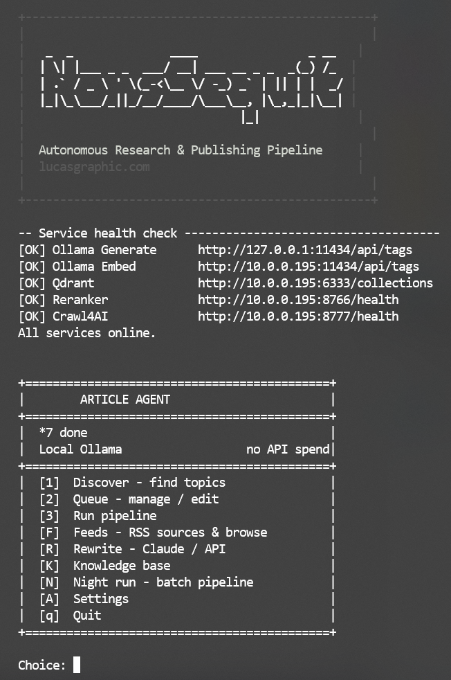
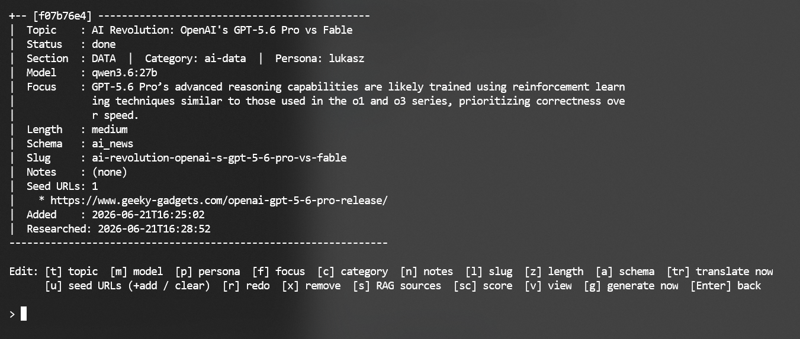
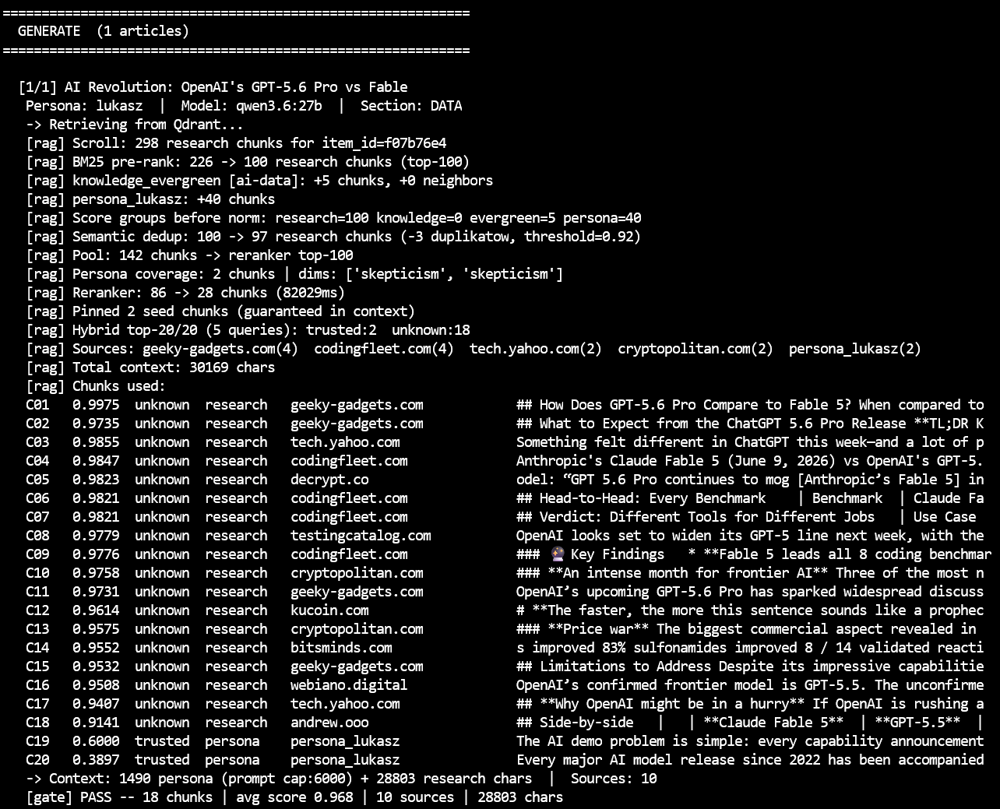
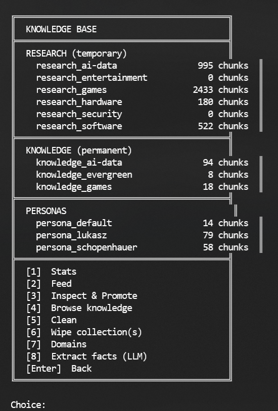
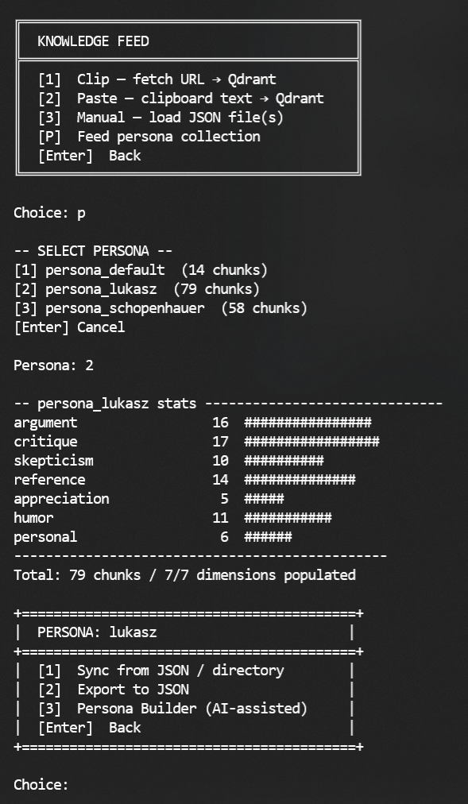

# Screenshots

All screenshots taken from a live session on Windows 11 (RTX 5090, 128GB RAM) with Ubuntu server (GTX 1080) running Qdrant, reranker, SearXNG, and Crawl4AI.

---

### 01 — Main menu

Startup banner and main navigation. Service health check runs automatically on launch — Ollama, Qdrant, reranker, and Crawl4AI status displayed before any menu interaction.

---

### 02 — Queue list

Queue overview showing all items with score, verdict (EXCE/STRO/PASS/WEAK/FAIL), schema, model, and category. Items persist across sessions in `queue.json`.

---

### 03 — Queue inspect

Per-item inspect view. Editable fields: topic, model, persona, focus, category, schema, length, slug, notes, seed URLs. `[tr]` triggers immediate Bielik translation of the selected generation.

---

### 04 — Uber Research

Gap analysis pass: existing chunks are scrolled from Qdrant, an LLM identifies research gaps relative to the article focus, then runs targeted SearXNG queries with BM25 URL pre-scoring. New chunks are embedded and indexed. Example: 45 new chunks added, article score jumped from 6.1/WEAK to 8.0/STRONG.

---

### 05 — RAG retrieval and reranking

Retrieval pipeline: BM25 pre-rank from Qdrant scroll, semantic dedup, reranker cross-encoder scoring (BAAI/bge-reranker-v2-m3), persona chunk injection, suitability gate check. Each chunk shows reranker score and source tier (press / trusted / unknown).

---

### 06 — Focus picker with BM25 scores

20 article angles generated by the LLM, sorted by BM25 research coverage score. Right-aligned `cov` column allows instant visual comparison. Original LLM index shown in parentheses. `[r]` rerolls with temperature 0.95 for fresh angles. `[arg]` marker shown for argumentative schemas where BM25 systematically underscores thematic focuses.

---

### 07 — Scoring system

Full scoring breakdown: ANCHOR score, argument structure (A1-A4), disqualifiers (D1-D10), quality signals (Q1-Q8), genericity signals (G1-G4), voice consistency. Verdict tiers: EXCELLENT (9.0+), STRONG (8.0+), PASS (7.0+), WEAK (5.0+), FAIL (<5.0). Prescription generated for rewrites.

---

### 08 — Knowledge base

Knowledge base menu: browse, feed, extract, and clean operations across `research_*`, `knowledge_*`, and `knowledge_evergreen` Qdrant collections. Evergreen chunks have no TTL and are reused across articles.

---

### 09 — Persona feeder and creator

Persona Builder: builds voice chunks across 7 rhetorical dimensions (argument, critique, skepticism, reference, appreciation, humor, personal). Chunks stored in `persona_lukasz` Qdrant collection (79 chunks). Retrieved at generation time based on focus similarity — coverage-first, then relevance ranking.
